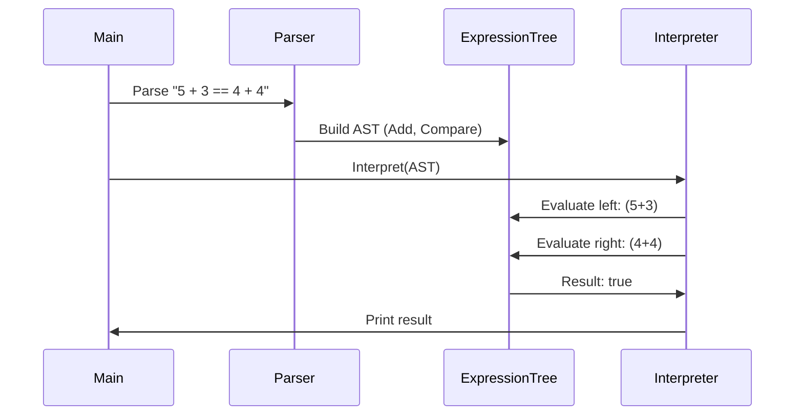
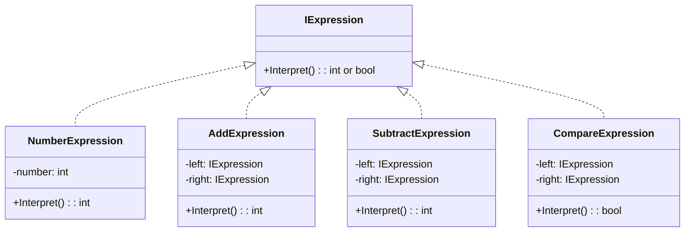

# 🧠 Interpreter Design Pattern – C# Implementation

## 📌 Purpose

The **Interpreter pattern** defines a grammar and provides an interpreter to evaluate sentences in the grammar.
Used to interpret expressions like mathematical formulas, rules, or scripted instructions.

This project interprets simple arithmetic + equality expressions like:

```csharp
"5 + 3 == 4 + 4"
```

It recursively parses and evaluates to `true`.

---

## 👨‍💼 Real-World Analogy

Think of a calculator that understands:

* Numbers
* Operations like `+`, `-`
* Comparisons like `==`

And you can **extend** it easily to understand more operators (`*`, `/`, `!=`, etc.).

---

## 📦 Folder Structure

```
Interpreter/
│
├── Interface/
│   └── IExpression.cs
│
├── Expressions/
│   ├── NumberExpression.cs
│   ├── AddExpression.cs
│   ├── SubtractExpression.cs
│   └── CompareExpression.cs
│
└── Program.cs
```

---

## 🔁 Sequence Flow



---

## 🔧 UML Diagram



---

## 🧪 Example

```csharp
string input = "5 + 3 == 4 + 4";
// Output: Result: True
```

---