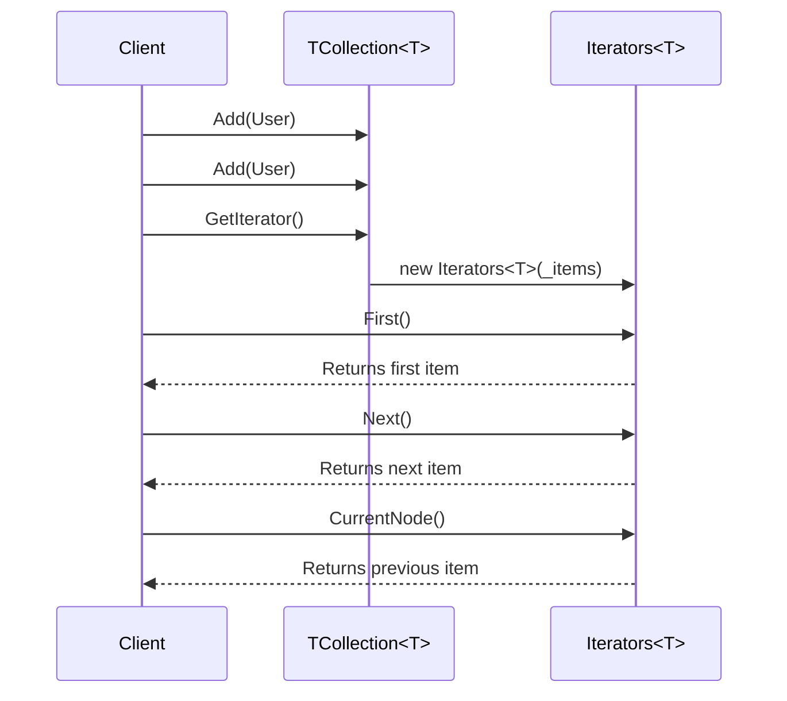

# Iterator Design Pattern in C# – Study & Showcase

This project demonstrates the **Iterator Design Pattern** using a real-world-like scenario with a custom `User` collection. This pattern provides a way to **sequentially access elements of a collection without exposing its underlying representation**.

---

## 🧠 When to Use Iterator Pattern?

* When you need to **traverse a collection** without exposing its internals (like list structure or tree logic).
* When you want to support **multiple simultaneous traversals**.
* When you want to provide a **uniform traversal interface** across different types of collections.

---

## ✅ Core Components

| Component        | Description                                                                       |
| ---------------- | --------------------------------------------------------------------------------- |
| `IIterator<T>`   | Defines the iterator interface (`First`, `Next`, `CurrentNode`, `Reset`).         |
| `Iterators<T>`   | Concrete implementation of `IIterator<T>` that encapsulates list traversal logic. |
| `TCollection<T>` | Aggregate that exposes `GetIterator()` and provides collection management.        |
| `User`           | A simple entity class with a `ToString()` override for clean console display.     |

---

## 📦 Project Structure

```
IteratorPattern/
│
├── Interface/
│   └── IIterator.cs
│
├── Entity/
│   └── User.cs
│
├── Iterators<T>.cs
├── TCollection<T>.cs
├── Program.cs
└── README.md
```

---

## 🔁 UML Class Diagram (Mermaid)

```mermaid
classDiagram
    class IIterator<T> {
        +T? First()
        +T? Next()
        +T? CurrentNode()
        +void Reset()
    }

    class Iterators<T> {
        -List<T> _items
        -int index
        +T? First()
        +T? Next()
        +T? CurrentNode()
        +void Reset()
    }

    class TCollection<T> {
        -List<T> _items
        +TCollection<T> Add(T item)
        +IIterator<T> GetIterator()
    }

    IIterator<T> <|.. Iterators<T>
    TCollection<T> --> Iterators<T>
```

---

## 🔄 Sequence Diagram (Mermaid)



---

## 🥮 Sample Output

```
Name : Sam
Name : Sam
Name : Mike
Name : Mike
Name : John
Name : Samual
Name : Sam
Name : Sam
Name : Sam
Name : Mike
Name : John
Name : Samual
Reached the end of the list.
```

---

## 🛠 Design Highlights

* **Nullable safety (`#nullable enable`)** for strict null-handling.
* **Encapsulation of traversal** logic inside `Iterators<T>`.
* **Fluent API** for collection population: `collection.Add(...).Add(...)`.
* **Exceptions** clearly inform when the iterator is empty or exhausted.
* Clean output with meaningful `ToString()` override in `User`.

---

## 🤠 Tips for Review

* Emphasize that this design pattern decouples **collection structure** from **iteration logic**.
* Highlight how this allows **multiple independent iterators** and supports **complex iteration logic** like filtering or pagination if extended.
* You can plug this logic easily into an **IEnumerable<T> adapter**, if needed.

---

## 👨‍💻 Developer

Designed and implemented by **Kishore**  
Senior .NET Full-Stack Developer  
System Design & Clean Architecture Enthusiast  
[GitHub: @Kishi05](https://github.com/Kishi05)
