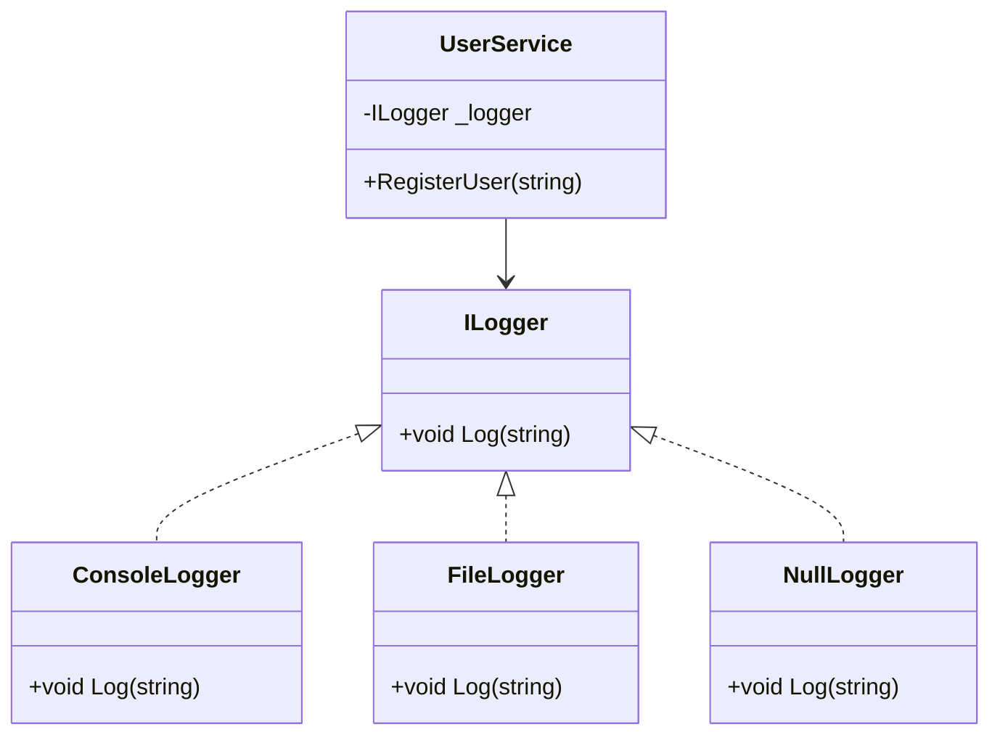
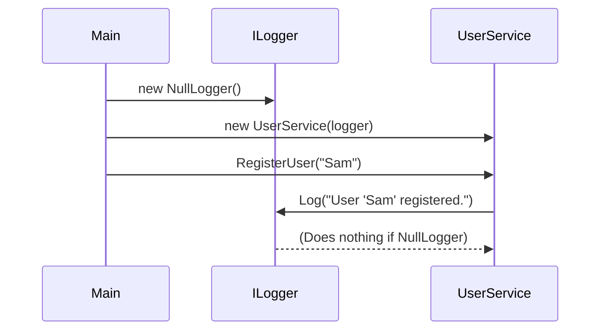

# Null Object Design Pattern – C# Implementation

The **Null Object Pattern** is a behavioral design pattern that provides a default object to replace `null`. Instead of checking for `null` values, we use an object that implements the required interface but with **no-op behavior**.

---

## 🧠 Purpose

To avoid `null` checks and ensure smooth code execution by providing a "do-nothing" implementation of an interface.

---

## 📦 Components

- `ILogger`: Interface
- `ConsoleLogger`, `FileLogger`: Concrete Loggers
- `NullLogger`: Implements ILogger but does nothing
- `UserService`: Depends on ILogger to log activity

---

## 🧬 UML Class Diagram



---

## 🔁 Sequence Diagram



---

## 🚀 Sample Usage

```
using NullObject.Interface;
using NullObject.Logger;
using NullObject.Service;

ILogger logger = new NullLogger(); // or new ConsoleLogger(), FileLogger()
UserService service = new(logger);
service.RegisterUser("Sam");
```

---

## Output (With ConsoleLogger)

```csharp
[Console] User 'Sam' registered.
```

## ✅ Output (With NullLogger)

```pgsql
(nothing is logged, no error thrown)
```

---

## 🧠 Benefits

- Avoids null checks
- Implements Open/Closed Principle
- Clean and readable code
- Easily testable and swappable logger behavior

---

## 👨‍💻 Developer

Designed and implemented by **Kishore**  
Senior .NET Full-Stack Developer  
System Design & Clean Architecture Enthusiast  
[GitHub: @Kishi05](https://github.com/Kishi05)