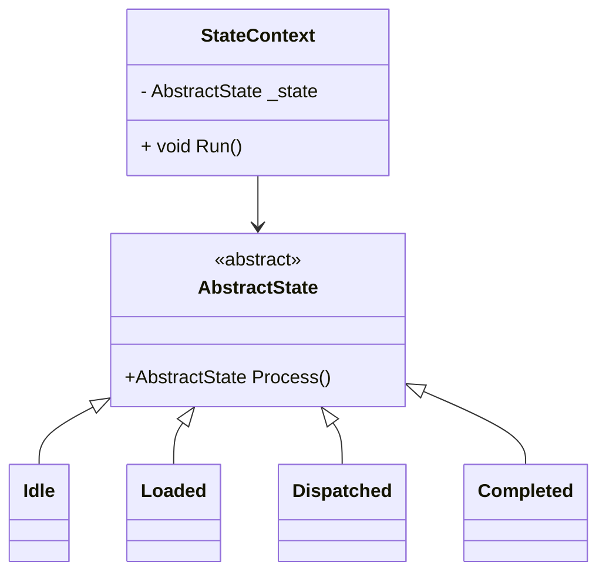
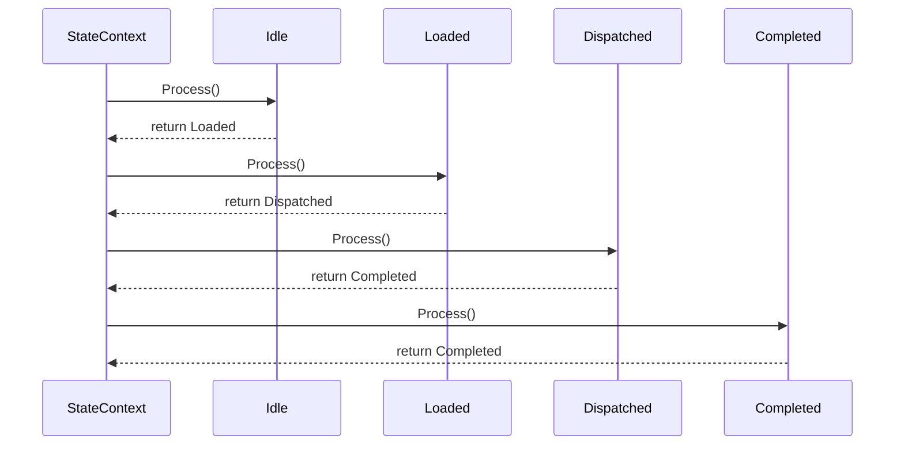


# 🧠 State Pattern in C# — Object-Oriented Implementation

This repository demonstrates a pure object-oriented implementation of the **State Design Pattern** in C#. It eliminates the need for conditionals, enums, or switch-case blocks and instead uses **state-to-state transitions via polymorphism**.

---

## ✅ Output

```
Idle State
Money Loaded
Item Dispatched
Process Complete
```

---

## 🧾 Overview

The **State Pattern** allows an object to alter its behavior when its internal state changes. This example models a simple workflow:

```
Idle → Loaded → Dispatched → Completed
```

---

## 🧱 Class Structure

| Class           | Description                                      |
|-----------------|--------------------------------------------------|
| `AbstractState` | Abstract base class with the `Process()` method |
| `Idle`          | Initial state                                    |
| `Loaded`        | Simulates money loaded state                     |
| `Dispatched`    | Represents item dispatch                         |
| `Completed`     | Final terminal state                             |
| `StateContext`  | Holds and drives the current state               |

---

## 📦 UML Class Diagram (Mermaid)



---

## 🔁 Sequence Diagram (Mermaid)



---

## 📁 Folder Structure

```
/StatePattern
|-- Abstract/
|   |-- AbstractState.cs
|
|-- States/
|   |-- Idle.cs
|   |-- Loaded.cs
|   |-- Dispatched.cs
|   |-- Completed.cs
|
|-- StateContext.cs
|-- Program.cs
|-- README.md
```

---

## 💡 Learning Outcome

This pattern reinforces:
> _"Avoid conditionals by letting objects manage their own transitions through polymorphism."_  
It aligns with **Open/Closed Principle**, **Single Responsibility**, and clean architecture design.

---

## 👨‍💻 Developer

Designed and implemented by **Kishore**  
Senior .NET Full-Stack Developer  
System Design & Clean Architecture Enthusiast  
[GitHub: @Kishi05](https://github.com/Kishi05)