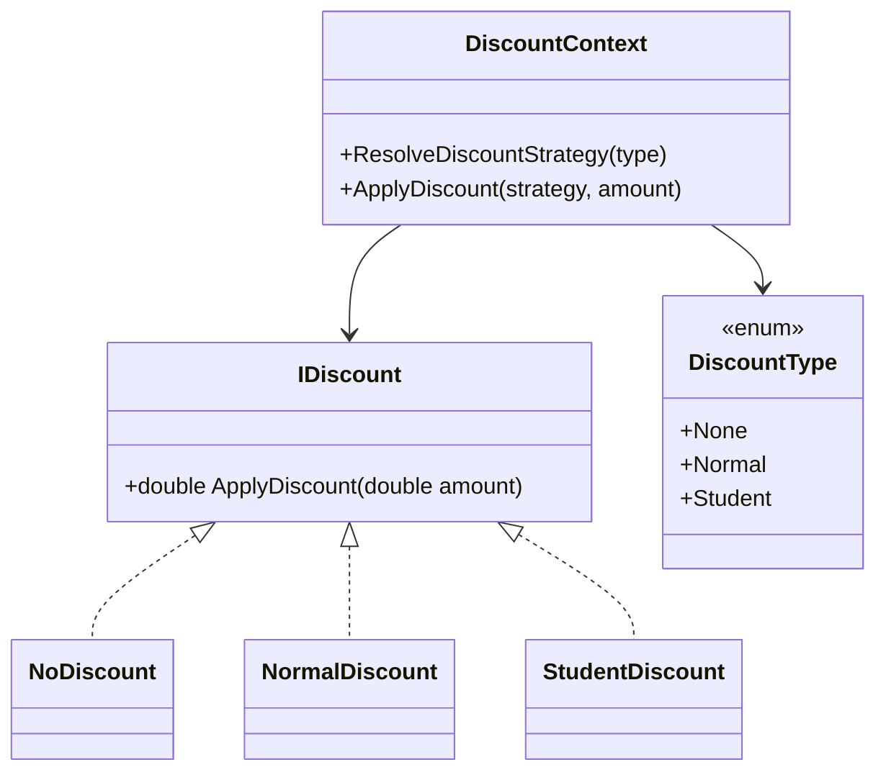
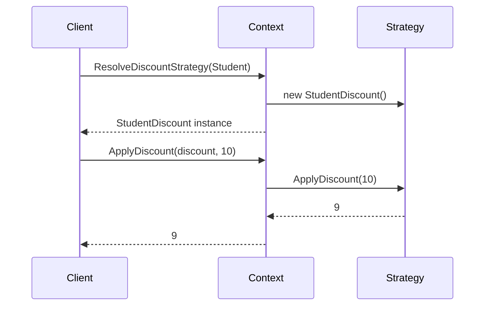

# Strategy Design Pattern (C#)

## 💡 What is Strategy Pattern?

The Strategy Pattern allows you to define a family of algorithms, encapsulate each one, and make them interchangeable. It enables the algorithm to vary independently from clients that use it.

---

## 🧱 Components in This Example

| Component         | Role                        |
|------------------|-----------------------------|
| `IDiscount`       | Strategy Interface           |
| `NoDiscount`      | Concrete Strategy (0%)       |
| `NormalDiscount`  | Concrete Strategy (5%)       |
| `StudentDiscount` | Concrete Strategy (10%)      |
| `DiscountContext` | Context to resolve & apply   |
| `DiscountType`    | Enum for strategy selection  |

---

## ✅ Key Takeaways

- Open/Closed Principle: Add new strategies without changing existing code.
- Behavior encapsulated in separate classes.
- Promotes code flexibility and testability.

---

## 📊 UML Diagram



---

## ▶️ Example Output

```
Amount : 10
Student Discount : 9
No Discount : 10
Normal Discount : 9.5
```


---

## ✅ 3. Sequence Diagram (Discount Strategy)



---

## 👨‍💻 Developer

Designed and implemented by **Kishore**  
Senior .NET Full-Stack Developer  
System Design & Clean Architecture Enthusiast  
[GitHub: @Kishi05](https://github.com/Kishi05)