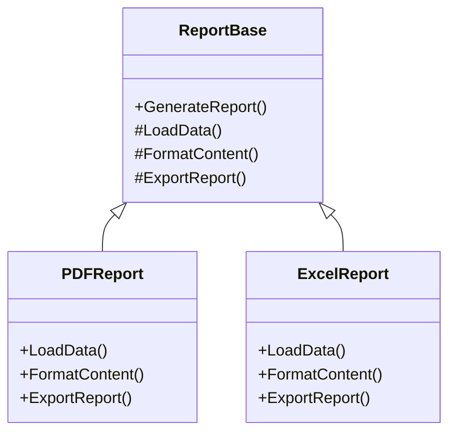

# 🧩 Template Pattern (Behavioral Pattern)

## 🔍 What is the Template Pattern?

The Template Pattern defines the **skeleton of an algorithm** in the base class, deferring some specific steps to subclasses.  
It ensures a consistent workflow, while still allowing subclasses to override *parts* of the process.

> “Don’t call us, we’ll call you.” – The base class controls the flow.

---

## 🧠 Real-World Analogy

Think of a **report generation process**:
- Steps: Load data → Format → Export
- PDF, Excel, HTML reports all follow the same **skeleton**
- But each one does these steps differently

---

## 📐 UML Diagram

### Text-based UML:
```
        +--------------------+
        |   ReportBase       |  <--- Abstract Class
        +--------------------+
        | +GenerateReport()  |
        | #LoadData()        |  <-- abstract
        | #FormatContent()   |  <-- abstract
        | #ExportReport()    |  <-- abstract
        +--------------------+
                 /\
                 ||
    ----------------------------------
    |                                |
 +------------------+ +-------------------+
 | PDFReport        | | ExcelReport       | <--- Concrete Classes
 +------------------+ +-------------------+
 | +LoadData()      | | +LoadData()       |
 | +FormatContent() | | +FormatContent()  |
 | +ExportReport()  | | +ExportReport()   |
 +------------------+ +-------------------+

```
---



---

## 📊 Sequence Diagram

```
Client --> PDFReport.GenerateReport()
Client --> ExcelReport.GenerateReport()

GenerateReport():
  └─> LoadData()
  └─> FormatContent()
  └─> ExportReport()

  ```

---
## 🔑 Key Points to Remember

| Concept         | Description                                               |
| --------------- | --------------------------------------------------------- |
| **Purpose**     | Define algorithm skeleton once, defer steps to subclasses |
| **Base Class**  | Contains `Template Method` with algorithm flow            |
| **Subclasses**  | Override specific steps only                              |
| **Reusability** | Avoid code duplication; maintain consistent logic flow    |
| **Control**     | Parent class controls execution order                     |

---

## ✅ When to Use

- You want to enforce a sequence of operations.
- The algorithm is mostly the same but has a few variable steps.
- You want subclasses to provide specific behavior without altering the structure.

---

## 💡 Benefits

- Code reuse across multiple implementations
- Promotes consistency
- Easier maintenance & extension

---

📦 Files Overview

```
TemplatePattern/
│
├── Reports/
│   ├── ReportBase.cs       => Abstract class with Template Method
│   ├── PDFReport.cs        => Concrete class - PDF flow
│   └── ExcelReport.cs      => Concrete class - Excel flow
│
└── Program.cs              => Demo client
```

---

## 🎯 Summary

- Template Pattern helps maintain a strict structure while allowing flexible steps.
- Avoids rewriting the overall logic across classes.
- Great for workflows that never change order but differ in implementation.